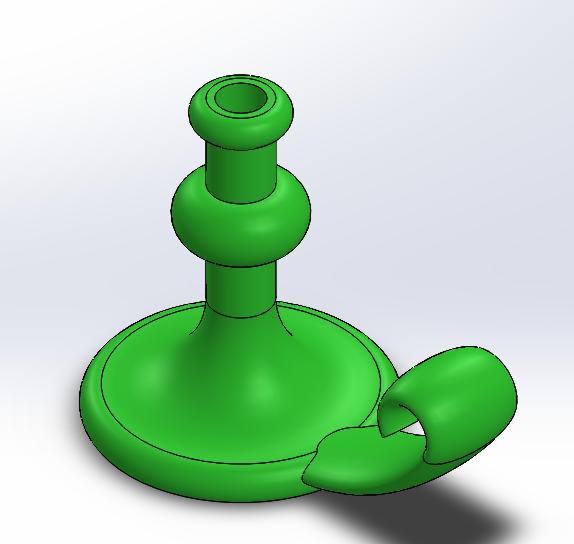
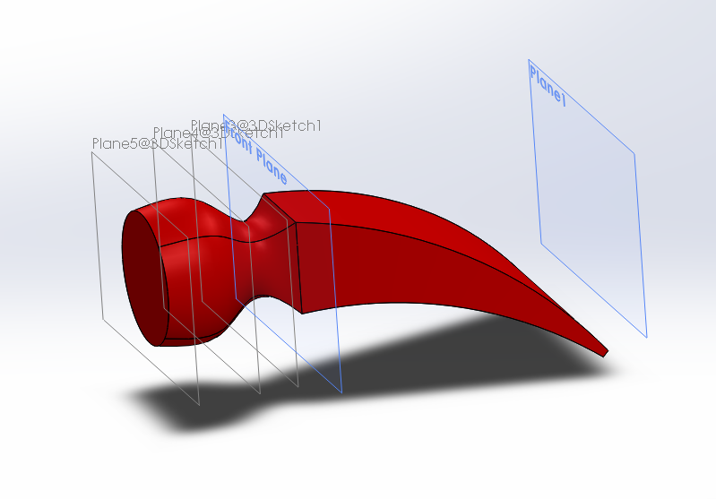

# not_so_basic_cad
my solidworks assignments showing various skills

# Sweeps&Lofts
I learned to use the tools based around sweeps and lofts

I made a candlestick using sweep tools

I made the head of a hammer using loft tools

