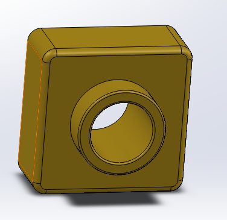

# not_so_basic_cad
my solidworks assignments showing various skills

# Sweeps&Lofts
I learned to use the tools based around sweeps and lofts

I made a candlestick using sweep tools

I made the head of a hammer using loft tools

# a_little_practice
I learned to make basic parts and fit them together in an assembly and reviewed a few basic tools like extruding and cutting

I design two parts and put them together in an assembly

I designed whatever this thing is with a few basic tools from last year

